# 作業 - 5-1 示範 Redis 如何執行淘汰機制

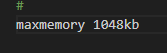

設定 maxmemory 為 1048kb，1024kb 太小，會直接無法存取

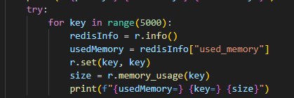

寫入{1:1}~{n:n}

每個 set 為 48bit

## noeviction

```
New values aren’t saved when memory limit is reached. When a database uses replication, this applies to the primary database
```

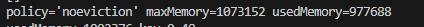

最終寫到 819 個數就不能繼續寫了

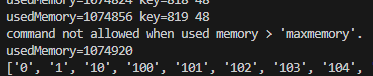

## allkeys-lru

```
Keeps most recently used keys; removes least recently used (LRU) keys
```

evict 會在超過記憶體限制後刪除 key 直到回到設定的記憶體以內

### 未對 redis 讀取時會刪除的 key

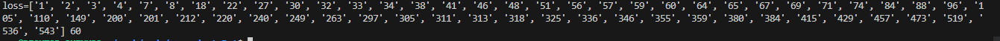

### 對 redis 讀取後有 key 不會被刪掉

因為有對 50 以內的 key 做讀取，符合這個 policy 不會被刪除的條件，所以 50 以內的值不會被刪掉

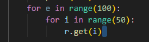
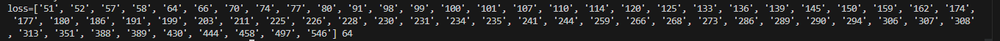

## allkeys-lfu

```
Keeps frequently used keys; removes least frequently used (LFU) keys
```

### 未對 redis 讀取時會刪除的 key

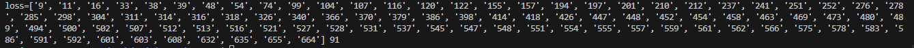

### 對 redis 讀取後有 key 不會被刪掉

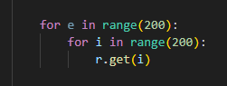
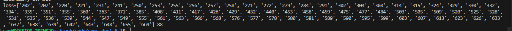

## volatile-lru

```
Removes least recently used keys with the expire field set to true.
```

會先判斷 expire 值，到期的先刪，以外的會再判斷最近有沒有存取

### 還沒讀 redis 前

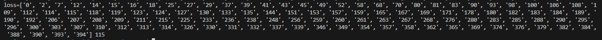

### 有讀取之後

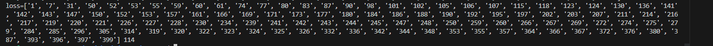

### expire 設為 1

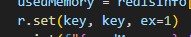
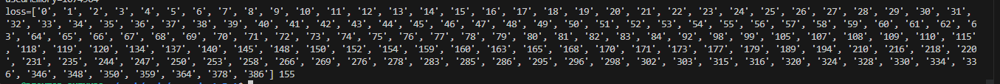

就算最近有讀取，但是到期依舊會被刪掉

## volatile-lfu

```
Removes least frequently used keys with the expire field set to true.
```

會先判斷 expire 值，到期的先刪，以外的會再判斷存取次數

## allkeys-random

```
Randomly removes keys to make space for the new data added.
```

隨機刪除，無法控制

## volatile-random

```
Randomly removes keys with expire field set to true.
```

隨機刪除到期的

## volatile-ttl

```
Removes keys with expire field set to true and the shortest remaining time-to-live (TTL) value.
```

會先判斷 expire 值，越低的越先刪

expire 設定為 600

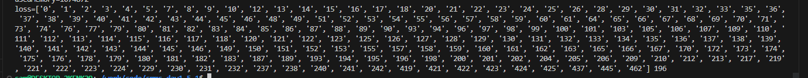
